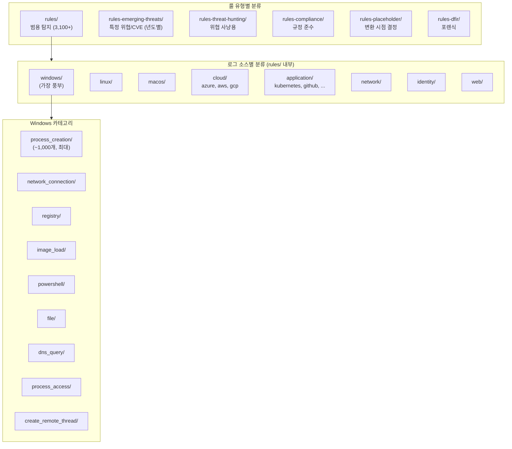
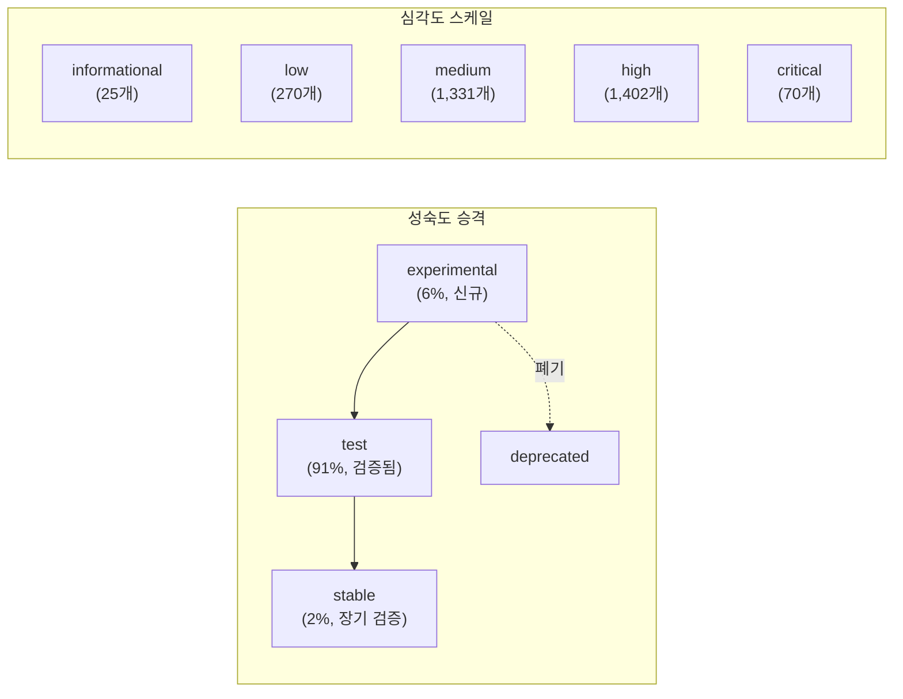
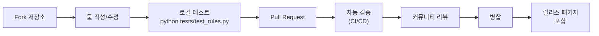

# Sigma — Architecture

## 룰 분류 체계



## 메타데이터 기반 다차원 분류

### 성숙도 × 심각도 매트릭스



### ATT&CK 태깅 기반 방어 커버리지

모든 룰에 MITRE ATT&CK 기법이 태깅되어 방어 커버리지를 정량적으로 평가할 수 있다.

**가장 많은 탐지가 있는 전술:**

| ATT&CK 전술 | 룰 수 | 의미 |
|-------------|-------|------|
| Defense Evasion | 1,404 | 방어 회피 탐지가 가장 풍부 |
| Persistence | 720 | 영속성 확보 탐지 |
| Execution | 658 | 실행 탐지 |
| Discovery | 400+ | 정보 수집 탐지 |
| Credential Access | 300+ | 자격증명 탈취 탐지 |

## 품질 관리 시스템

### CI/CD 검증 파이프라인


**`.github/workflows/sigma-test.yml`** 핵심 검증:

```yaml
# 1단계: YAML 문법
yamllint:
  - extends: default
  - indentation: {spaces: 4}
  - new-line-at-end-of-file: enable

# 2단계: 로그소스 필드 유효성
test-sigma-logsource:
  - 정의된 logsource만 허용
  - 필드명이 logsource.json에 존재하는지 확인

# 3단계: pySigma 구문 검증
sigma-check:
  - SigmaHQ 전용 검증 규칙 적용
  - 조건식 파싱 가능 여부

# 4단계: UUID 고유성
duplicate-id-check:
  - 모든 룰의 id가 유일한지 확인
```

### 회귀 테스트 데이터 — 실증 검증

**`regression_data/` 구조:**

```
regression_data/
  └─ rules/windows/image_load/
      └─ image_load_win_werfaultsecure_dbgcore/
          ├─ info.yml        # 테스트 메타데이터
          ├─ *.evtx          # 실제 Windows 이벤트 로그
          └─ *.json          # 파싱된 이벤트 데이터
```

**info.yml 구조:**

```yaml
id: 63b16abe-2d5c-4a2f-b0ae-f1bc4580e40c
author: Swachchhanda Shrawan Poudel (Nextron Systems)
rule_metadata:
  - id: 8a2f4b1c-3d5e-4f7a-9b2c-1e4f6d8a9c2b
    title: WerFaultSecure Loading DbgCore or DbgHelp
regression_tests_info:
  - name: Positive Detection Test
    type: evtx
    provider: Microsoft-Windows-Sysmon
```

**의의**: 룰이 실제 공격 이벤트 로그에서 의도대로 동작하는지 자동으로 검증한다.

### Atomic Red Team 통합

룰에 공격 시뮬레이션 테스트를 직접 매핑한다.

```yaml
simulation:
  - type: atomic-red-team
    name: GPP Passwords (findstr)
    technique: T1552.006
    atomic_guid: 870fe8fb-5e23-4f5f-b89d-dd7fe26f3b5f
```

**워크플로우**: Atomic Red Team 실행 → 이벤트 로그 수집 → Sigma 룰 매칭 검증

## 룰 배포 패키지 체계

**`Releases.md`** 에 정의된 큐레이션 전략:

| 패키지 | 포함 범위 | 대상 조직 |
|--------|----------|-----------|
| **Core** | stable/test + high/critical | 신규 조직 (안전한 기본값) |
| **Core+** | Core + medium | 성숙한 SOC |
| **Core++** | Core+ + experimental | 고급 탐지팀 |
| **Emerging Threats** | 시의성 높은 위협 전용 | 위협 인텔리전스 운영 |
| **All** | 전체 (높은 조정 필요) | 위협 사냥 전문팀 |

**설계 의도**: 조직의 성숙도에 따라 점진적으로 룰셋을 확장할 수 있는 체계.

## 룰 관계 시스템

### related 필드

룰 간 관계를 명시적으로 선언한다.

```yaml
related:
  - id: 2fbbe9ff-0afc-470b-bdc0-592198339968
    type: similar   # 비슷한 탐지 (예: Windows vs macOS 버전)
```

| 관계 유형 | 의미 |
|-----------|------|
| `similar` | 비슷한 탐지, 다른 관점 (플랫폼, 로그소스) |
| `derived` | 기존 룰에서 파생된 개선 버전 |
| `obsolete` | 이 룰로 대체된 이전 룰 |
| `duplicate` | 동일한 탐지 (정리 대상) |

## 커뮤니티 거버넌스

### 기여 워크플로우



### 유지보수자 구조

| 역할 | 담당자 | 책임 |
|------|--------|------|
| 창시자/전략 | Florian Roth (@cyb3rops) | 프로젝트 방향, 중대 결정 |
| 일일 관리 | Nasreddine Bencherchali (@nas_bench) | PR 리뷰, 룰 품질 |
| 기술 리드 | Christian Burkard (@phantinuss) | 검증 시스템, CI/CD |
| 커뮤니티 | François Hubaut (@frack113) | 기여자 지원 |
| pySigma/CLI | Thomas Patzke (@blubbfiction) | 변환 도구 |

## 파일명 규칙

룰 파일명이 로그소스와 의도를 즉시 전달하는 체계:

```
{category}_{product}_{description}.yml

예시:
proc_creation_win_7zip_exfil_dmp_files.yml
  ├─ proc_creation: 프로세스 생성 카테고리
  ├─ win: Windows 플랫폼
  └─ 7zip_exfil_dmp_files: 7Zip으로 덤프 파일 수집

dns_query_win_mal_cobaltstrike.yml
  ├─ dns_query: DNS 쿼리 카테고리
  ├─ win: Windows
  └─ mal_cobaltstrike: CobaltStrike 악성코드
```

---

## 배울 점

1. **다차원 분류 체계**: 유형별(rules, ET, TH) × 로그소스별(windows, linux, cloud) × 카테고리별(process_creation, registry) × 메타데이터별(status, level, ATT&CK)의 다층 분류로 4,000+ 룰을 체계적으로 관리
2. **패키지 큐레이션 전략**: Core → Core+ → Core++ → All로 조직 성숙도에 따른 점진적 확장. "모든 것을 한꺼번에"가 아닌 "필요한 만큼"의 철학
3. **회귀 테스트 데이터 + Atomic Red Team**: 실제 공격 이벤트 로그와 시뮬레이션을 결합한 실증 검증. 룰의 신뢰도를 주장이 아닌 데이터로 증명
4. **파일명 자체가 문서**: `proc_creation_win_susp_cmd.yml` 만으로 로그소스, 플랫폼, 의도를 즉시 파악 가능

## 적용 아이디어

| Sigma 아키텍처 | EDR AI 적용 |
|---------------|-------------|
| 다차원 분류 체계 | AI 분석 룰을 위협유형 × 데이터소스 × 심각도 × ATT&CK으로 분류하여 커버리지 맵 구축 |
| 패키지 큐레이션 | AI 분석 기능을 Core(필수 탐지) → Advanced(고급 분석) → Experimental(신규 기법)로 단계적 배포 |
| 회귀 테스트 | AI 분석 룰 변경 시 과거 보안 이벤트로 탐지율/오탐률 자동 검증하는 CI/CD |
| related 룰 관계 | AI 분석 룰 간 관계(유사, 파생, 대체)를 명시하여 룰 중복 방지와 진화 추적 |
| 성숙도 승격 체계 | AI 분석 룰의 experimental→test→stable 승격 프로세스로 프로덕션 안정성 보장 |
| 파일명 규칙 | AI 분석 룰/프롬프트 파일을 `{분석유형}_{데이터소스}_{위협명}.yaml`로 명명하여 즉시 식별 |
