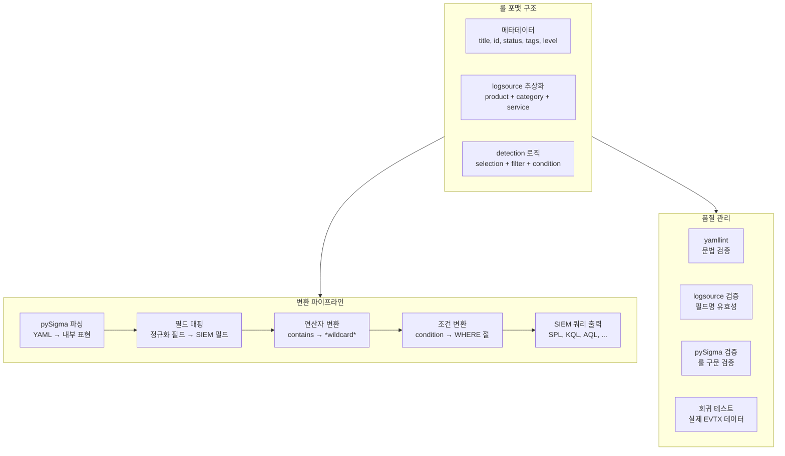
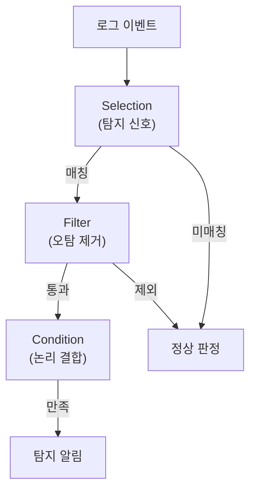

# Sigma — Core Logic

## 전체 실행 흐름



## 핵심 탐지 로직 패턴 상세 분석

### 1. Logsource 추상화 — SIEM 벤더 중립의 핵심

로그 출처를 3차원(product, category, service)으로 정규화하여 SIEM 벤더 종속성을 제거한다.

```yaml
logsource:
    product: windows          # OS/플랫폼
    category: process_creation # 이벤트 타입
    # service는 선택적 (sysmon, security 등)
```

**변환 시 필드 매핑** (`tests/logsource.json`에 정의):

```
Sigma 정규화 필드        → Sysmon EventID 1      → Windows Security 4688
─────────────────────────────────────────────────────────────────────
Image                    → Image                  → NewProcessName
CommandLine              → CommandLine             → CommandLine
ParentImage              → ParentImage             → ParentProcessName
User                     → User                    → SubjectUserName
```

**설계 의도**: 분석가는 표준 필드명(Image, CommandLine)만 알면 되고, SIEM 변환기가 자동으로 올바른 필드에 매핑한다.

### 2. 3계층 탐지 구조 (Selection/Filter/Condition)

Sigma 룰의 가장 핵심적인 설계 패턴이다.



**실제 예시** — LSASS 자격증명 덤프 탐지 (`proc_access_win_lsass_susp_access_flag.yml:25-122`):

```yaml
detection:
    # 1. 탐지 신호: LSASS에 대한 의심스러운 접근 권한
    selection_target:
        TargetImage|endswith: '\lsass.exe'
    selection_access:
        - GrantedAccess|endswith:
              - '30'
              - '50'
              - '70'
        - GrantedAccess|startswith:
              - '0x100000'
              - '0x1418'

    # 2. 오탐 제거: 합법적 프로세스 제외
    filter_main_generic:
        SourceImage|contains:
            - ':\Program Files (x86)\'
            - ':\Program Files\'
    filter_main_trustedinstaller:
        Image: 'C:\Windows\servicing\TrustedInstaller.exe'

    # 3. 논리 결합: 신호 AND NOT 필터
    condition: all of selection_* and not 1 of filter_main_* and not 1 of filter_optional_*
```

**설계 이점**:
- **의도 명확성**: 무엇을 탐지하려 하고, 무엇을 제외하는지 한눈에 파악
- **유지보수성**: 새 오탐 발견 시 filter만 추가
- **재사용성**: 다른 조직이 자신의 환경에 맞는 filter를 추가 가능

### 3. 필드 연산자 체이닝

Sigma의 가장 강력한 기능으로, 연산자를 파이프(`|`)로 조합한다.

**기본 연산자:**

| 연산자 | 사용 빈도 | 의미 |
|--------|----------|------|
| `\|contains` | 3,688회 | 문자열 포함 |
| `\|endswith` | 2,759회 | 끝 문자 매칭 |
| `\|startswith` | 465회 | 시작 문자 매칭 |
| `\|re` | 167회 | 정규표현식 |
| `\|all` | - | 모든 값 AND |
| `\|windash` | - | Windows 대시 정규화 (/-와 -- 동일) |
| `\|cidr` | - | IP 주소 범위 매칭 |
| `\|base64` | - | Base64 인코딩 매칭 |

**체이닝 예시** — 여러 연산자 조합:

```yaml
# contains + all: 세 문자열이 모두 포함되어야 함
CommandLine|contains|all:
    - 'powershell'
    - 'downloadstring'
    - 'http'

# contains + windash: Windows 경로 구분자 정규화
CommandLine|contains|windash:
    - 'start '
    - 'start/b'
```

### 4. 조건 문법 (Condition Syntax)

다양한 논리 결합을 선언적으로 표현한다.

| 조건 문법 | 의미 | 예시 |
|-----------|------|------|
| `selection` | 단일 선택 | 기본 매칭 |
| `all of selection_*` | 모든 selection AND | 이미지+커맨드라인 동시 매칭 |
| `1 of selection*` | 하나 이상 OR | 여러 IOC 중 하나 |
| `selection and not filter` | 탐지 AND NOT 필터 | 오탐 제거 |
| `selection \| count() by Host > 5` | 집계 조건 | 시간 내 반복 행위 (미지원 SIEM 있음) |

### 5. 대표 탐지 패턴 분석

#### 5.1 행위 기반 탐지 — 7Zip으로 덤프 파일 수집

**`proc_creation_win_7zip_exfil_dmp_files.yml:20-34`**:

```yaml
detection:
    selection_img:
        - Description|contains: '7-Zip'
        - Image|endswith:
              - '\7z.exe'
              - '\7zr.exe'
              - '\7za.exe'
        - OriginalFileName:
              - '7z.exe'
              - '7za.exe'
    selection_extension:
        CommandLine|contains:
            - '.dmp'
            - '.dump'
            - '.hdmp'
    condition: all of selection_*
```

**분석**: 이미지 조건(7-Zip 프로세스)과 파일 확장자 조건(덤프 파일)을 AND로 결합. 3가지 방법(Description, Image path, OriginalFileName)으로 프로세스를 식별하여 이름 변경을 통한 회피를 차단한다.

#### 5.2 IOC 기반 탐지 — CobaltStrike DNS 비콘

**`dns_query_win_mal_cobaltstrike.yml:21-27`**:

```yaml
detection:
    selection1:
        QueryName|startswith:
            - 'aaa.stage.'
            - 'post.1'
    selection2:
        QueryName|contains: '.stage.123456.'
    condition: 1 of selection*
```

**분석**: 알려진 CobaltStrike DNS 비콘 패턴을 OR로 탐지. 하나라도 매칭되면 높은 신뢰도의 알림.

#### 5.3 방어 회피 탐지 — 이모지 난독화

**`proc_creation_win_potential_defense_evasion_via_emoji_usage_3.yml:7-232`**:

```yaml
detection:
    selection:
        CommandLine|contains:
            - '🦆'
            - '🦅'
            # ... (200+ 이모지)
    condition: selection
```

**분석**: 정상 명령줄에서 이모지는 극히 드물기 때문에, 이모지 존재 자체가 난독화 시도를 강하게 시사한다. 창의적이면서도 오탐률이 매우 낮은 룰.

#### 5.4 CIDR 기반 네트워크 필터링

**`net_connection_lnx_susp_malware_callback_port.yml:38-47`**:

```yaml
filter_main_local_ranges:
    DestinationIp|cidr:
        - '127.0.0.0/8'
        - '10.0.0.0/8'
        - '172.16.0.0/12'
        - '192.168.0.0/16'
        - '::1/128'        # IPv6 loopback
        - 'fe80::/10'      # IPv6 link-local
        - 'fc00::/7'       # IPv6 private
```

**분석**: 내부 네트워크 범위를 CIDR 표기법으로 정확하게 제외. IPv4와 IPv6를 모두 커버한다.

#### 5.5 클라우드 로그 탐지

**`azure_conditional_access_failure.yml:17-23`**:

```yaml
logsource:
    product: azure
    service: signinlogs
detection:
    selection:
        ResultType: 53003
        Resultdescription: Blocked by Conditional Access
    condition: selection
```

**분석**: Azure AD 로그의 정수 코드와 설명을 직접 매칭. 클라우드 환경에서도 동일한 Sigma 문법이 적용됨을 보여준다.

### 6. 표현력의 한계

| 한계 | 설명 | 현재 대안 |
|------|------|----------|
| 통계적 탐지 | Baseline/이상치 계산 불가 | SIEM 네이티브 ML 기능 |
| 복잡한 상관 분석 | 크로스 이벤트 상관 제한적 | `unsupported/` 폴더에 실험적 규칙 |
| 동적 임계값 | if-then-else 로직 없음 | SIEM 저장 프로시저 |
| 성능 최적화 힌트 | 인덱스/쿼리 최적화 메타데이터 없음 | SIEM별 수동 튜닝 |

---

## 배울 점

1. **Selection/Filter/Condition 3계층 분리**: 탐지 의도와 오탐 제거를 구조적으로 분리하면 룰의 가독성, 유지보수성, 재사용성이 동시에 향상. 특히 filter를 `filter_main_*`과 `filter_optional_*`로 세분화하는 패턴이 인상적
2. **연산자 체이닝의 표현력**: `|contains|all|windash` 같은 파이프 조합으로 SQL이나 정규식 없이도 복잡한 매칭 로직을 선언적으로 표현. 낮은 진입장벽과 높은 표현력의 양립
3. **다중 식별 전략**: 프로세스를 Image path, Description, OriginalFileName 3가지로 동시에 식별하여 이름 변경을 통한 회피를 차단. 방어적 탐지 설계의 모범
4. **falsepositives 필드의 가치**: 룰의 한계를 명시하면 운영팀이 기대 수준을 조정하고 환경에 맞는 필터를 추가할 수 있음

## 적용 아이디어

| Sigma 패턴 | EDR AI 적용 |
|------------|-------------|
| 3계층 탐지 구조 | AI 분석 프롬프트를 "탐지 기준(selection)" + "정상 패턴 예외(filter)" + "최종 판단(condition)"으로 구조화 |
| 연산자 체이닝 | AI 분석 룰에서 `field\|contains\|all` 같은 선언적 조건을 파싱하여 LLM 프롬프트로 자동 변환 |
| 다중 식별 전략 | 위협 프로세스 판별 시 이미지 경로, 해시, 설명, 서명을 동시에 확인하는 다중 검증 |
| CIDR 필터링 | AI가 네트워크 이벤트 분석 시 내부/외부 IP를 CIDR 기반으로 자동 분류 |
| falsepositives 명시 | AI 분석 결과에 "알려진 오탐 패턴"을 함께 제공하여 분석가의 판단을 지원 |
